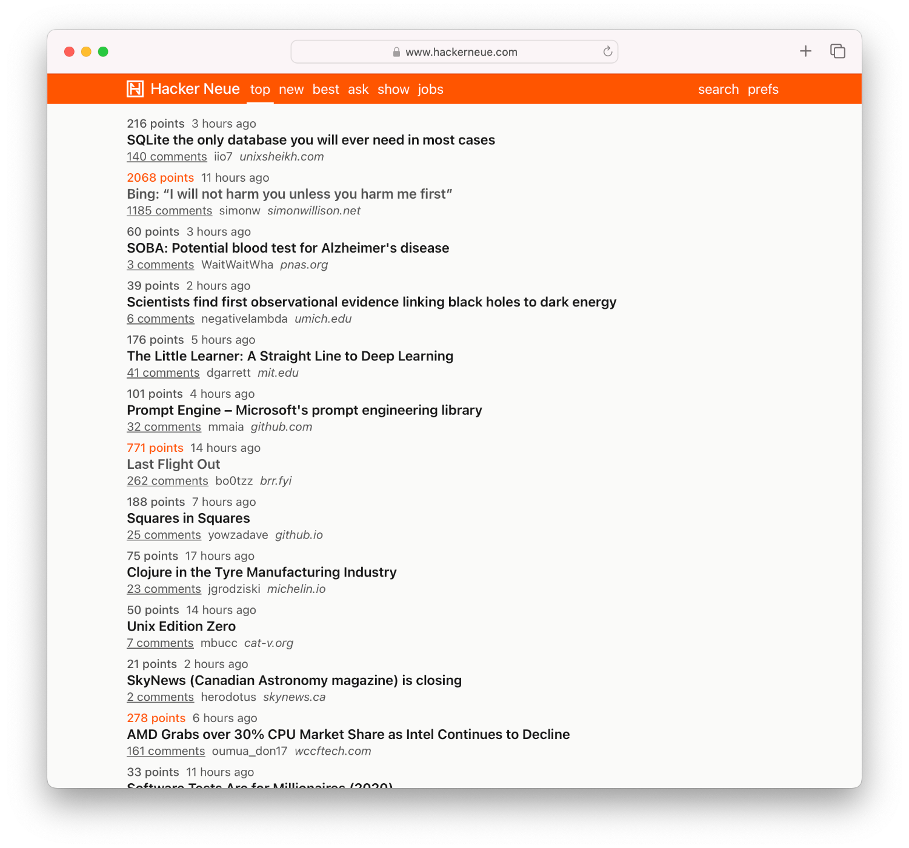

# Hacker Neue

A web-based [Hacker News](https://news.ycombinator.com) client using the [Hacker News API](https://github.com/HackerNews/API). **Live at [www.hackerneue.com](https://www.hackerneue.com).**



## Running Locally

* Clone the repository

  ```sh
  git clone https://github.com/r-thomson/Hacker-Neue.git
  ```

* Install dependencies

  ```sh
  npm install
  ```

* Start the development server

  ```sh
  npm run dev
  ```

* Visit [localhost:3000](http://localhost:3000)

## Built With

* [Svelte](https://svelte.dev)
* [Vite](https://vitejs.dev)
* TypeScript
