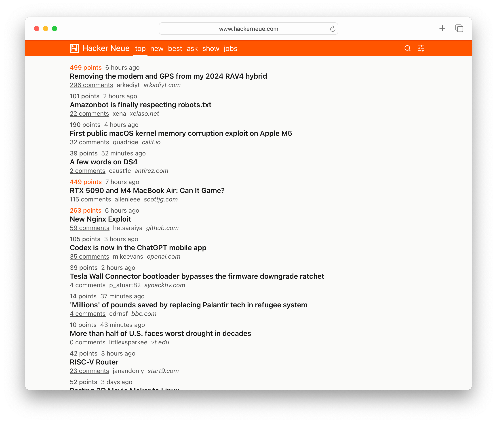

# Hacker Neue

A web-based [Hacker News](https://news.ycombinator.com) client built on top of the [Hacker News API](https://github.com/HackerNews/API). **Live at [www.hackerneue.com](https://www.hackerneue.com).**



## Running Locally

Hacker Neue requires a recent version of [Node.js](https://nodejs.org/en).

1. Check out the repository

	```sh
	git clone https://github.com/r-thomson/Hacker-Neue.git
	```

2. Install dependencies

	```sh
	npm install
	```

3. Start the development server

	```sh
	npm run dev
	```

4. Visit [localhost:3000](http://localhost:3000)

## Built With

* [Svelte 5](https://svelte.dev)
* [Vite](https://vitejs.dev)
* TypeScript
